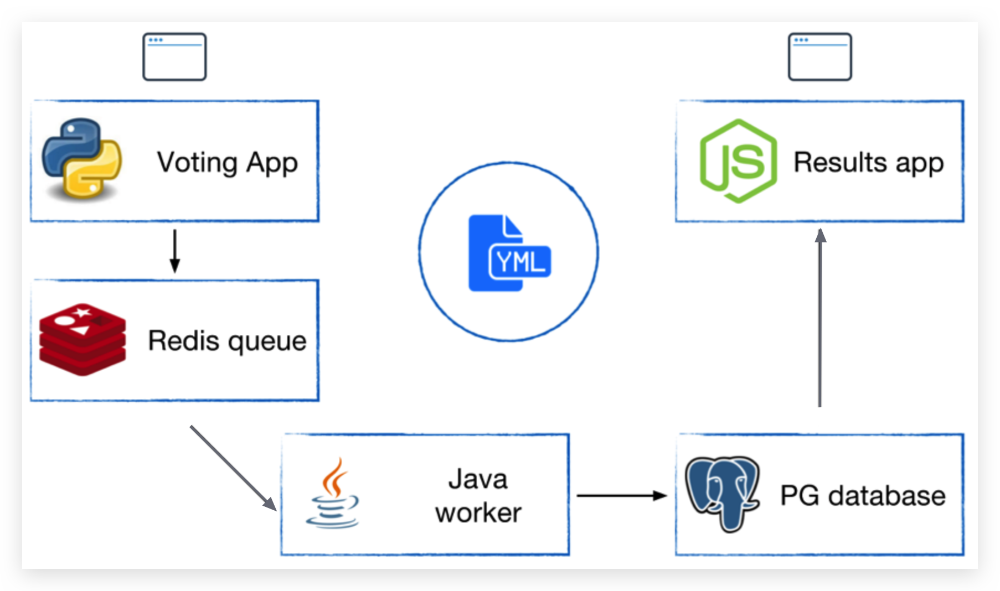

Example Voting App
==================

This is an example Docker app with multiple services. It is run with Docker Compose and uses Docker Networking to connect containers together. You will need Docker Compose 1.6 or later.

Architecture
-------

Voting App 是一个投票界面，因为大家都来投票，所以它的访问量比较大，直接把投票数据写入 Redis 缓存。

Java worker 会从 Redis 中取投票结果，然后写入 PG 数据库。

Results app 会从 PG 中读取数据，实时显示候选人的得票情况。

Running
-------

Run in this directory:

    $ docker-compose up
